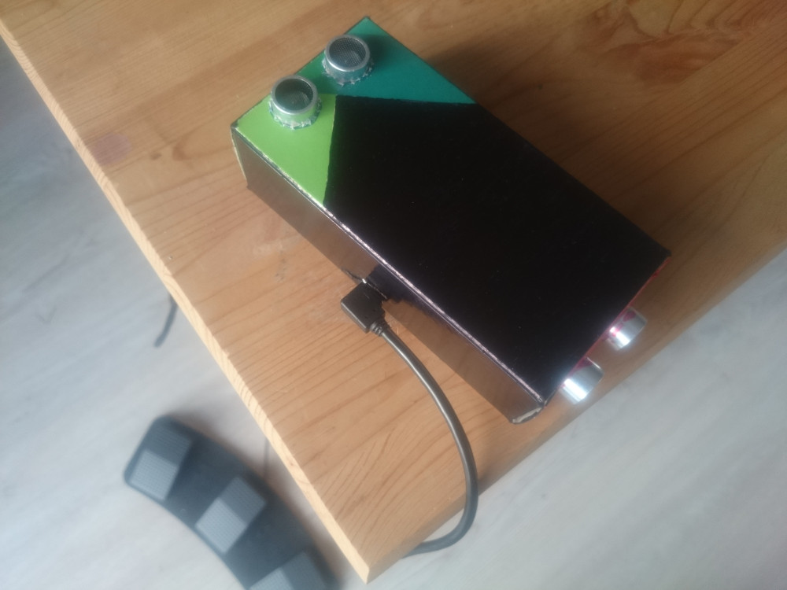
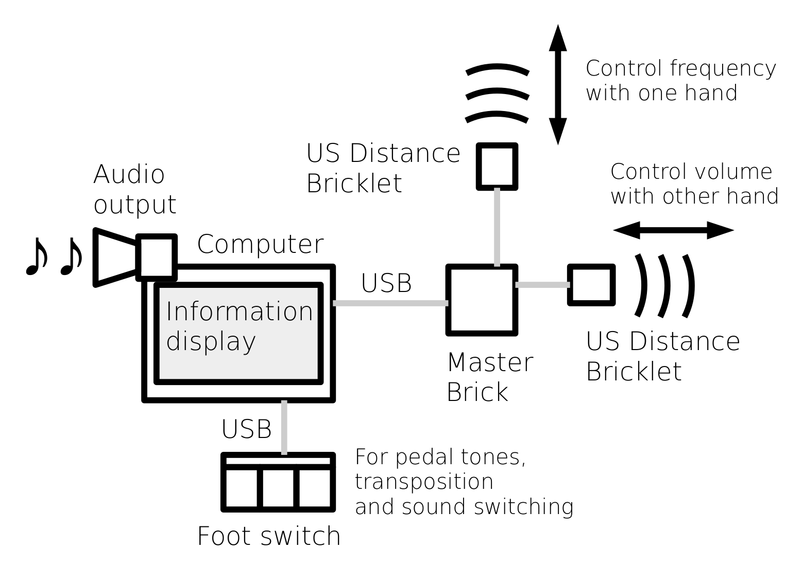
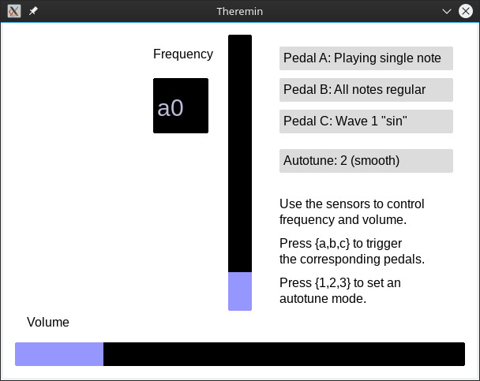

# A sensor-driven, digital Theremin

Out of fun and interest, I built a [Theremin](https://en.wikipedia.org/wiki/Theremin)-like instrument, being played entirely touchless with both hands. The idea was to use simple distance sensors with a digital output to do the audio synthesis on a computer. This allows for interesting and fun ways to tinker with the instrument, such as "auto-tune", different audio waveforms or multiple tones at the same time.

On this page, I am going to explain the instrument and the framework: how to build, how to install and how to use it. If you are interested in the process of creating the whole thing, visit my [project blog](https://github.com/domschrei/theremin/wiki/Digital-%22theremin%22:-Project-blog) where I explain it in detail.



The hardware part is really easy – I used two "Tinkerforge" [ultrasonic distance sensors](https://www.tinkerforge.com/de/doc/Hardware/Bricklets/Distance_US.html#distance-us-bricklet) connected to a [master brick](https://www.tinkerforge.com/de/doc/Hardware/Bricks/Master_Brick.html), which directly communicates with the computer via USB. A simple USB triple foot switch turned out to be a great addition in order to trigger specific effects.



I also developed a small framework for my Theremin to work. The application's tasks are

* periodically polling sensor data;
* synthesizing smooth audio waves out of the raw data;
* sending the samples to the SDL audio mixer;
* processing additional inputs (from keyboard or foot switch) for specific effects; and
* displaying the instrument's current state in a simple graphical interface.



I am using C++ with the [SDL2](https://www.libsdl.org/) library (_core_ and _ttf_) and the Tinkerforge frameworks, especially the [C(++) bindings for the Tinkerforge sensors](https://www.tinkerforge.com/de/doc/Software/API_Bindings_C.html). No further dependencies are needed.

## Setup and Installation

### Hardware

First, the Tinkerforge sensors and the master brick mentioned above are needed, as well as a triple foot switch like [this one](https://www.amazon.de/dp/B00WS2GZU2/ref=sr_ph?ie=UTF8&qid=1484338452&sr=1&keywords=usb+foot+pedal) (there are many providers for this specific piece). A plain old computer with USB input and audio output should do the job of running the application – a Raspberry Pi should work nice, as well.

A mini USB cable must connect the master brick with the computer.

### Software

I am developing and executing the program on Linux only, so I will describe the process for Linux systems. 
However, it should not really be a problem to get it running on other platforms, as all used tools and frameworks are cross-platform.

Install the `gcc`, `make` and the `SDL2` library (the application uses the standard libraries and the _ttf_ libraries).

In order to fetch and build [the C(++) bindings for Tinkerforge](https://www.tinkerforge.com/en/doc/Downloads.html#downloads-bindings-examples):
* You can just execute `bash get_tinkerforge.sh` (hereby, the script assumes that the commands `wget` and `unzip` are available). 
* Alternatively, you can manually download them from [here](https://www.tinkerforge.com/en/doc/Downloads.html#downloads-bindings-examples) and extract them into a `tinkerforge` directory which needs to be at the same level as the `src` directory of the Theremin application. Inside the `tinkerforge/source` directory, execute the command `make` to compile the Tinkerforge bindings. 

Also, install the daemon [brickd](https://www.tinkerforge.com/en/doc/Software/Brickd.html#brickd) which will enable communication between the computer and the brick, and the UI assistant [brickv](https://www.tinkerforge.com/en/doc/Software/Brickv.html#brickv) to initially fetch the UIDs of your sensors.

Execute
```
sudo brickd --daemon
```
and open `brickv`. You should now be able to connect to your master brick and see the connected two distance sensors. Get their three-figure UIDs (for example, `uvw` and `xyz`) and replace the definitions of `UID_FREQUENCY` and `UID_VOLUME` inside the file `src/config.h` with your UIDs.
```
#define UID_FREQUENCY "uvw" // UID of ultrasonic distance sensor #1
#define UID_VOLUME "xyz" // UID of ultrasonic distance sensor #2
```
(It does not matter which of the sensors is assigned to which constant, as you can just swap them.)

You can now compile the Theremin application by executing
```
bash build.sh
```
inside the application's root folder, which should let an executable called `theremin` appear.

Now, with `brickd` still running, you can execute the application (`./theremin`) and play Theremin! The USB foot switch should be plug-and-play.

## Using and tweaking

To properly play the instrument, the sensors should be fastened and aligned. A 90 degree approach as shown in the blueprint works fine, with the frequency sensor pointing upwards and the volume sensor pointing to the side. Of course, the sensors can be built into a little box just like I have done (I could have taken a much smaller box if it wasn't for the long connection cables I bought).

Playing with pure hands is possible, but I experienced rather heavy noise and inaccuracies. To achieve really clear results, you can cut out two large circles of cupboard and glue some straps for your hands on it. The cupboard will reflect the ultrasonic waves very well.

### Foot switch

The foot switch has the following options:

* Left pedal: The current frequency will be stored and will continue to play until the pedal gets pressed another time. You can move your hand and play two tones at once.
* Central pedal: Until the pedal gets pressed another time, all tones will be played exactly one octave higher. This can be used to extend the pitch range of the instrument.
* Right pedal: Each press switches the waveform which is being used for audio synthesis. I implemented some pretty random waveforms, with varying results.

Internally, the foot switch just puts out the letters "a", "b" and "c" respectively, just like a keyboard. Hence, you can use the keys of your keyboard as well (which, however, is much less convenient than a foot switch).

### Autotune modes

The application supports some types of frequency aligning: `none`, `smooth` and `full`. You can change the type by pressing 1, 2 or 3 respectively, and they have the following effects:

* `none`: The distance value of the sensor gets directly mapped to a frequency (in an exponential manner, such that moving the hand by the same amount on different height levels should yield roughly the same frequency interval).
* `smooth`: Works like `none`, but adds a specific sine wave to the frequency such that the played tone gets "pushed" towards proper halftones, but in-between frequencies are possible nonetheless.
* `full`: Every input frequency (the output of the `none` mode) will be aligned towards the halftone which has the minimal distance to the current frequency. This will make the output tone "jump" in between halftones but always produce properly aligned tones.
