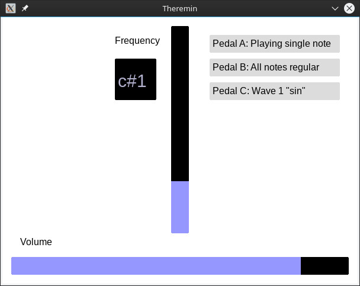

# A sensor-driven, digital Theremin

Out of fun and interest, I built a [Theremin](https://en.wikipedia.org/wiki/Theremin)-like instrument, being played entirely touchless with both hands. The idea was to use simple distance sensors with a digital output to do the audio synthesis on a computer. This allows for interesting and fun ways to tinker with the instrument, such as "auto-tune", different audio waveforms or multiple tones at the same time.


The hardware part is really easy – I used two "Tinkerforge" [ultrasonic distance sensors](https://www.tinkerforge.com/de/doc/Hardware/Bricklets/Distance_US.html#distance-us-bricklet) connected to a [master brick](https://www.tinkerforge.com/de/doc/Hardware/Bricks/Master_Brick.html), which directly communicates with the computer via USB. A simple USB triple foot switch turned out to be a great addition in order to trigger specific effects.


I also developed a small framework for my Theremin to work. The application's tasks are

* periodically polling sensor data;
* synthesizing smooth audio waves out of the raw data;
* sending the samples to the SDL audio mixer;
* processing additional inputs (from keyboard or foot switch) for specific effects; and
* displaying the instrument's current state in a simple graphical interface.



I am using C++ with the [SDL2](https://www.libsdl.org/) library (_core_ and _ttf_) and the Tinkerforge frameworks, especially the [C(++) bindings for the Tinkerforge sensors](https://www.tinkerforge.com/de/doc/Software/API_Bindings_C.html). No further dependencies are needed.

## Setup and Installation

### Hardware

First, the Tinkerforge sensors and the master brick mentioned above are needed, as well as a triple foot switch like [this one](https://www.amazon.de/dp/B00WS2GZU2/ref=sr_ph?ie=UTF8&qid=1484338452&sr=1&keywords=usb+foot+pedal) (there are many providers for this specific piece). A plain old computer with USB input and audio output should do the job of running the application – a Raspberry Pi should work nice, as well.

A mini USB cable must connect the master brick with the computer.

### Software

I am developing and executing the program on Linux only, so I will describe the process for Linux systems. 
However, it should not really be a problem to get it running on other platforms, as everything is cross-platform.

Install the `gcc`, `make` and the `SDL2` library (the application uses the standard libraries and the _ttf_ libraries).

Download the C(++) bindings for Tinkerforge [from their homepage](https://www.tinkerforge.com/en/doc/Downloads.html#downloads-bindings-examples). Then create a `tinkerforge` directory at the same level as the `src` directory of the Theremin application. The `tinkerforge` directory has to contain the `source` directory which can be extracted from the downloaded ZIP.

Also, install the daemon [brickd](https://www.tinkerforge.com/en/doc/Software/Brickd.html#brickd) which will enable communication between the computer and the brick, and the UI assistant [brickv](https://www.tinkerforge.com/en/doc/Software/Brickv.html#brickv) to initially fetch the UIDs of your sensors.

Execute
```
sudo brickd --daemon
```
and open `brickv`. You should now be able to connect to your master brick and see the connected two distance sensors. Get their three-figure UIDs (for example, `uvw` and `xyz`) and replace the definitions of `UID_FREQUENCY` and `UID_VOLUME` inside the file `src/config.h` with your UIDs.
```
#define UID_FREQUENCY "uvw" // UID of ultrasonic distance sensor #1
#define UID_VOLUME "xyz" // UID of ultrasonic distance sensor #2
```
(It does not matter which of the sensors is assigned to which constant, as you can just swap them.)

Inside the `tinkerforge/source` directory, execute 
```
make
```
to compile the Tinkerforge bindings. You can now compile the Theremin application by executing
```
bash build.sh
```
inside the application's root folder, which should let an executable called `theremin` appear.

Now, with `brickd` still running, you can execute the application (`./theremin`) and play Theremin! The USB foot switch should be plug-and-play.
